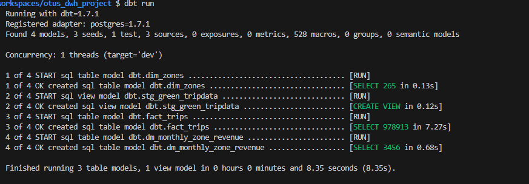

 ### Создание аналитического ХД для анализа данных по такси-перевозкам
## Configure environment

1. Install prerequisites:
    - IDE (e.g. [VS Code](https://code.visualstudio.com/docs/setup/setup-overview))
    - [Docker](https://docs.docker.com/engine/install/)

1. Fork & Clone this repository and open in IDE

1. Spin up Docker containers

    All the services are configured via [Docker containers](./docker-compose.yml).

    - devcontainer
    - Postgres

    ```bash
    # build dev container
    devcontainer build .

    # open dev container
    devcontainer open .
    ```

    

1. Verify you are in a development container by running commands:

    ```bash
    dbt --version
    ```


## Install dbt packages

1. Install modules via [packages.yml](./packages.yml)

    ```bash
    dbt clean # clean temp files
    dbt deps # install dependencies (modules)
    ```
## Seed data 
1. Seed data csv files(taxi_zone_lookup, green_taxi_tripdata)

    ```bash
    dbt debug # check the connection to postgres
    dbt seed 
    ```
    

## Run all models
1. run models
    ```bash
    dbt run
    ```


